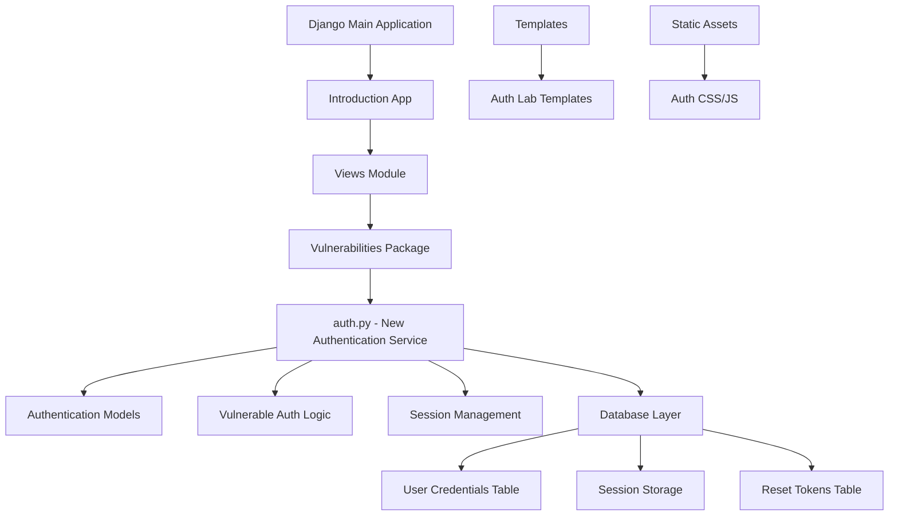
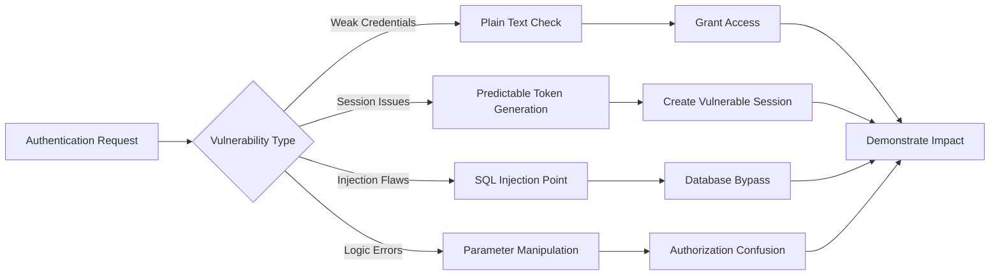
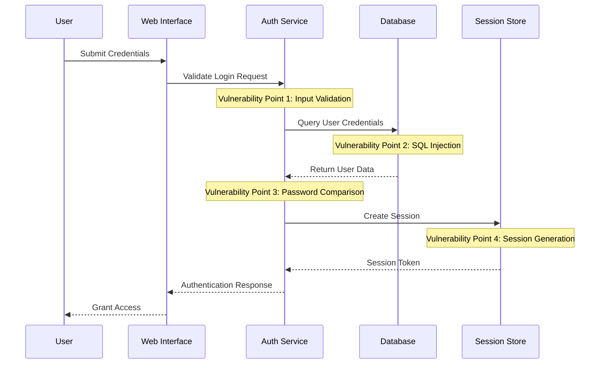

# Vulnerable Authentication Service Design

## Overview

This design outlines the development of a vulnerable authentication service module (`auth.py`) for the SymbPyGoat educational security platform. The service will demonstrate multiple authentication vulnerabilities based on OWASP Top 10 - A07:2021 Identification and Authentication Failures, providing hands-on learning opportunities for security practitioners.

SymbPyGoat is a Django-based intentionally vulnerable web application designed for cybersecurity education. The new authentication service will integrate seamlessly with the existing vulnerability demonstration framework while introducing critical authentication security flaws commonly found in real-world applications.

## Architecture

### Service Integration Pattern

The vulnerable authentication service follows SymbPyGoat's modular vulnerability architecture, integrating with the existing Django framework structure:



### Component Architecture

The authentication service comprises several interconnected components designed to showcase different vulnerability categories:

| Component | Purpose | Vulnerability Focus |
|-----------|---------|-------------------|
| Credential Storage | User account management | Weak password policies, plain text storage |
| Authentication Logic | Login validation | Brute force susceptibility, timing attacks |
| Session Management | User session handling | Session fixation, insecure tokens |
| Password Reset | Account recovery | Predictable tokens, information disclosure |
| Authorization Control | Access level management | Privilege escalation, role confusion |

## Authentication Vulnerability Framework

### Primary Vulnerability Categories

The authentication service demonstrates multiple critical security flaws organized into distinct learning modules:

#### 1. Weak Credential Management
- **Plain Text Password Storage**: Passwords stored without encryption or hashing
- **Weak Password Policies**: No complexity requirements or length restrictions
- **Default Credentials**: Administrative accounts with predictable credentials
- **Password Enumeration**: Username and password validation reveals account existence

#### 2. Session Security Failures
- **Session Fixation**: Sessions not regenerated after authentication
- **Predictable Session Tokens**: Sequential or easily guessable session identifiers
- **Insecure Session Storage**: Session data exposed in client-side storage
- **Missing Session Timeout**: Sessions remain active indefinitely

#### 3. Authentication Bypass Mechanisms
- **SQL Injection in Authentication**: Login forms vulnerable to database injection
- **Logic Flaws**: Authentication can be circumvented through parameter manipulation
- **Race Conditions**: Concurrent authentication requests cause security bypasses
- **Time-based Attacks**: Authentication timing reveals valid usernames

#### 4. Account Recovery Vulnerabilities
- **Predictable Reset Tokens**: Password reset tokens generated using weak algorithms
- **Token Disclosure**: Reset tokens exposed in application responses or logs
- **Account Enumeration**: Reset functionality reveals valid email addresses
- **Insufficient Token Validation**: Reset tokens lack proper expiration or uniqueness

### Vulnerability Implementation Strategy

Each vulnerability category includes multiple implementation variants to demonstrate different attack vectors:



## Data Models & Storage Design

### User Account Structure

The authentication service utilizes dedicated database tables optimized for demonstrating storage vulnerabilities:

| Field | Data Type | Vulnerability Aspect |
|-------|-----------|---------------------|
| user_id | AutoField | Primary key for user identification |
| username | CharField(50) | No uniqueness validation in some scenarios |
| password | CharField(100) | Stored in plain text for certain labs |
| email | EmailField | Used for enumeration demonstrations |
| role | CharField(20) | Role-based access control flaws |
| is_active | BooleanField | Account lockout bypass opportunities |
| created_at | DateTimeField | Timing attack surface |
| last_login | DateTimeField | Session management correlation |

### Session Management Schema

Session handling demonstrates multiple session security anti-patterns:

| Field | Purpose | Vulnerability Demonstration |
|-------|---------|---------------------------|
| session_id | Session identifier | Predictable generation algorithms |
| user_reference | User association | Insecure user binding |
| creation_time | Session establishment | Missing timeout implementation |
| last_activity | Activity tracking | Improper session validation |
| session_data | State information | Sensitive data exposure |

### Password Reset Token Design

The reset mechanism showcases token-based authentication vulnerabilities:

| Field | Data Type | Security Flaw |
|-------|-----------|---------------|
| token_id | Primary key | Sequential token generation |
| user_email | Associated account | Email enumeration vector |
| reset_token | Recovery credential | Weak randomization algorithm |
| expiry_time | Token validity | Extended or missing expiration |
| used_status | Usage tracking | Token reuse possibilities |

## Authentication Flow Design

### Standard Login Process

The authentication workflow incorporates multiple vulnerability points throughout the user journey:



### Password Recovery Workflow

The account recovery process demonstrates token-based authentication flaws:

```mermaid
stateDiagram-v2
    [*] --> InitiateReset : User requests reset
    InitiateReset --> ValidateEmail : Check email format
    ValidateEmail --> GenerateToken : Create reset token
    
    note left of GenerateToken : Vulnerability: Weak token generation
    
    GenerateToken --> SendToken : Deliver reset link
    SendToken --> TokenValidation : User clicks link
    
    note right of TokenValidation : Vulnerability: Insufficient validation
    
    TokenValidation --> ResetPassword : Allow password change
    ResetPassword --> [*] : Process complete
    
    ValidateEmail --> [*] : Invalid email (enumeration risk)
    TokenValidation --> [*] : Invalid token
```

## Vulnerability Lab Scenarios

### Lab 1: Plain Text Password Storage
**Objective**: Demonstrate the risks of storing passwords without proper hashing
**Implementation**: User credentials stored directly in database without encryption
**Learning Outcome**: Understanding of password hashing necessity and proper implementation

### Lab 2: Session Fixation Attack
**Objective**: Showcase session management vulnerabilities
**Implementation**: Sessions not regenerated after successful authentication
**Attack Vector**: Attacker provides session ID before user authentication
**Learning Outcome**: Proper session lifecycle management

### Lab 3: SQL Injection Authentication Bypass
**Objective**: Demonstrate injection vulnerabilities in authentication
**Implementation**: Login form parameters directly concatenated into SQL queries
**Attack Vector**: Malicious input bypasses authentication logic
**Learning Outcome**: Parameterized query usage and input validation

### Lab 4: Predictable Password Reset Tokens
**Objective**: Illustrate weak token generation vulnerabilities
**Implementation**: Reset tokens generated using predictable algorithms
**Attack Vector**: Token prediction enables unauthorized account access
**Learning Outcome**: Cryptographically secure random token generation

### Lab 5: Username Enumeration
**Objective**: Show information disclosure through authentication responses
**Implementation**: Different error messages for invalid usernames vs. passwords
**Attack Vector**: Brute force username discovery through response analysis
**Learning Outcome**: Consistent error messaging and timing considerations

## API Security Design

### Authentication Endpoint Structure

The service provides multiple API endpoints, each demonstrating specific vulnerability patterns:

| Endpoint | Method | Vulnerability Focus | Authentication Required |
|----------|--------|-------------------|----------------------|
| `/auth/login` | POST | Multiple login flaws | No |
| `/auth/register` | POST | Registration abuse | No |
| `/auth/reset-request` | POST | Token generation flaws | No |
| `/auth/reset-confirm` | POST | Token validation issues | No |
| `/auth/profile` | GET | Authorization bypass | Yes (Vulnerable) |
| `/auth/admin` | GET | Privilege escalation | Yes (Flawed check) |

### Request/Response Security Analysis

Each endpoint implements deliberately flawed security measures:

#### Login Endpoint Vulnerabilities
- **Request Validation**: Missing input sanitization allows injection attacks
- **Rate Limiting**: No brute force protection enables credential stuffing
- **Response Timing**: Reveals valid usernames through timing differences
- **Error Messages**: Information disclosure through detailed error responses

#### Registration Endpoint Flaws
- **Duplicate Prevention**: Weak uniqueness validation allows account conflicts
- **Input Validation**: Insufficient data validation enables malicious registrations
- **Email Verification**: Missing verification allows fake account creation
- **Password Policy**: No complexity requirements enable weak credentials

## Testing Strategy

### Vulnerability Validation Framework

The authentication service includes comprehensive testing scenarios to validate each security flaw:

#### Automated Security Testing
- **Injection Testing**: Automated SQL injection payload validation
- **Brute Force Simulation**: Credential stuffing attack simulation
- **Session Analysis**: Session token predictability assessment
- **Token Security**: Reset token randomness validation

#### Manual Penetration Testing Scenarios
- **Authentication Bypass**: Manual testing of logic flaws
- **Privilege Escalation**: Role-based access control validation
- **Information Disclosure**: Error message and timing analysis
- **Session Management**: Session fixation and hijacking attempts

#### Educational Assessment Tools
- **Vulnerability Scanners**: Integration with common security tools
- **Code Analysis**: Static analysis of vulnerable code patterns
- **Attack Simulation**: Guided exploitation exercises
- **Remediation Validation**: Secure implementation comparison

### Learning Outcome Measurement

Each lab scenario includes specific learning objectives and assessment criteria:

| Lab Module | Vulnerability Concept | Assessment Method | Success Criteria |
|------------|---------------------|------------------|------------------|
| Password Storage | Hashing importance | Exploitation demonstration | Successful credential extraction |
| Session Security | Token management | Session hijacking | Unauthorized access achievement |
| Injection Flaws | Input validation | SQL injection bypass | Authentication circumvention |
| Token Security | Cryptographic randomness | Token prediction | Password reset exploitation |
| Information Disclosure | Error messaging | Username enumeration | Valid account discovery |